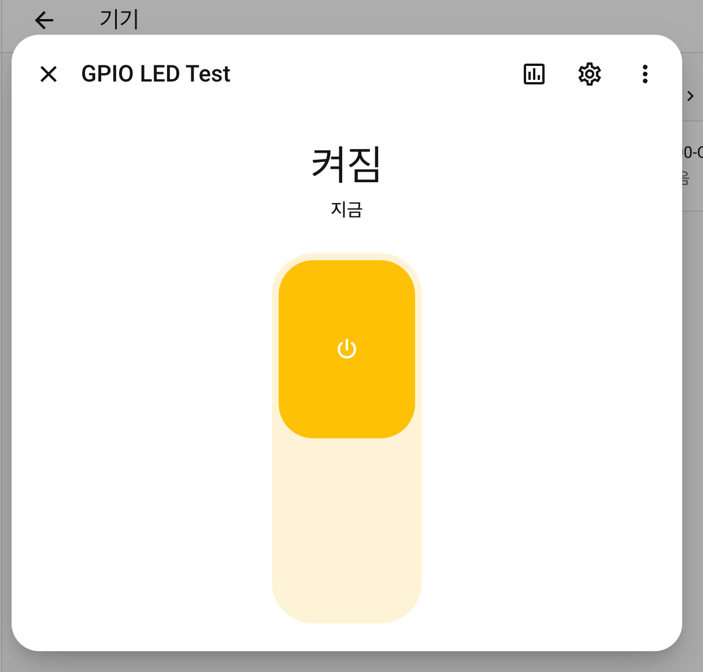
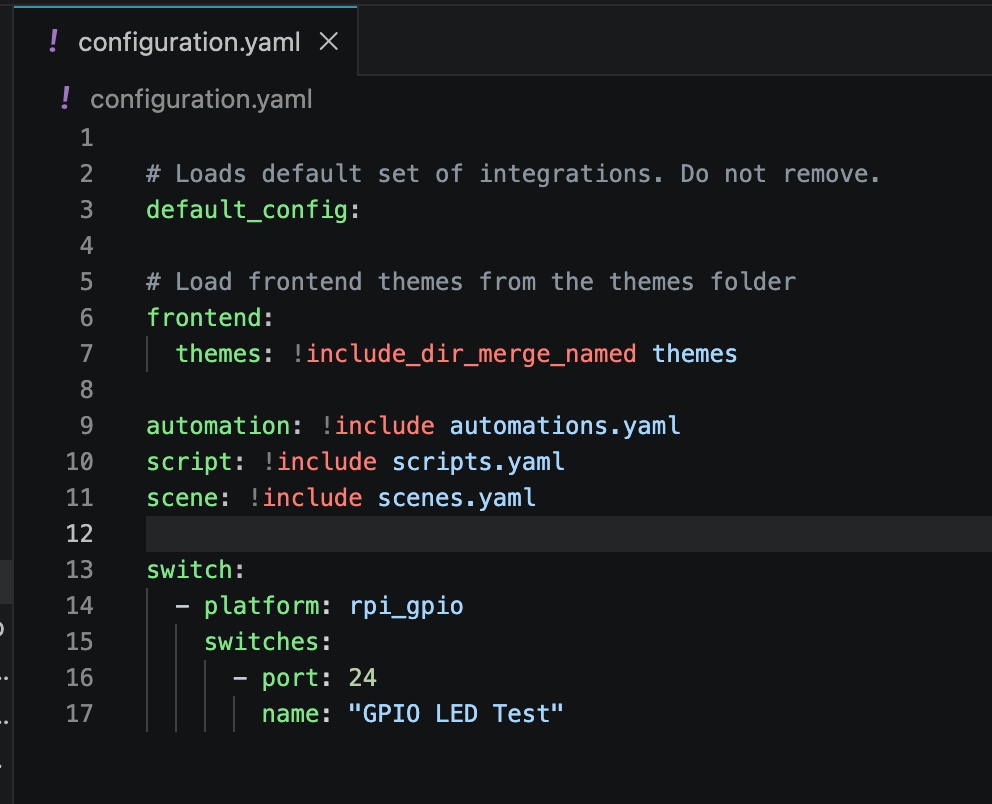

# IoT26_HW05

Additional images are available in images/orig.

노다연

  

튜토리얼 페이지의 Etcher 프로그램 설치할 필요 없이 라즈비안 설치할 때 쓰던 Imager 프로그램에서 바로 설치 가능합니다 (OS 선택 화면 → Other specific-purpose OS → Home automation → Home Assistant). 초기 설정을 위해 랜선이 필요합니다. 파이5에서 IO 컨트롤러가 바뀌며 더이상 GPIO 제어를 사용할 수 없다고 합니다.

박시후

  

수행 과정에서 달라진 점
1. **Home Assistant OS 대신 Docker 방식 사용** — Wi-Fi 연결·SSH 접근 문제로 변경
2. **Samba Share Add-on 미사용** — PuTTY SSH + nano 편집기로 `configuration.yaml` 직접 수정
3. **GPIO LED 연동 실패** — `Integration 'rpi_gpio' not found.` (최신 Docker 기반 HA에서 rpi_gpio 제거됨)
