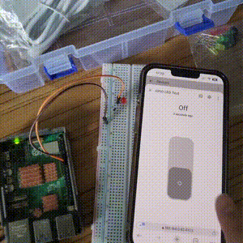
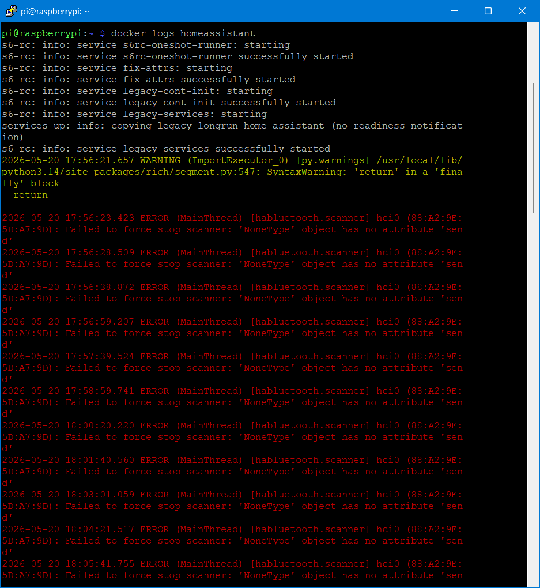

# IoT26_HW05

Additional images are available in images/orig.


박시후




----

튜토리얼 페이지를 따라 진행하는 경우, 사진과 같은 오류가 발생하여 진행이 불가하였습니다.
RPi5에서 IO 컨트롤러의 변경으로 더이상 기존 Integration을 사용할 수 없다는 것을 확인하였고, 대신 HACS를 통한 Custom Integration을 사용하였습니다.

수행 과정
1. Custom Integration 설치를 위해 먼저 HACS를 설치합니다. 자세한 설치 방법은 세한 설치 방법은 [여기](https://hacs.xyz/docs/use/)서 확인하실 수 있습니다.
2. HACS에서 'Raspberry Pi GPIO'를 검색하여 설치합니다.
3. `configuration.yaml`에 아래 내용을 추가합니다.

```yaml
switch:
  - platform: rpi_gpio
    switches:
      - port: 24
        name: "GPIO LED Test"
```
